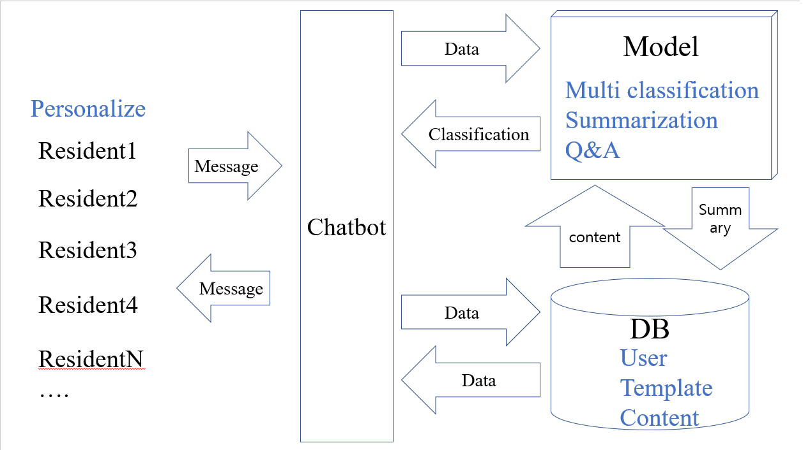
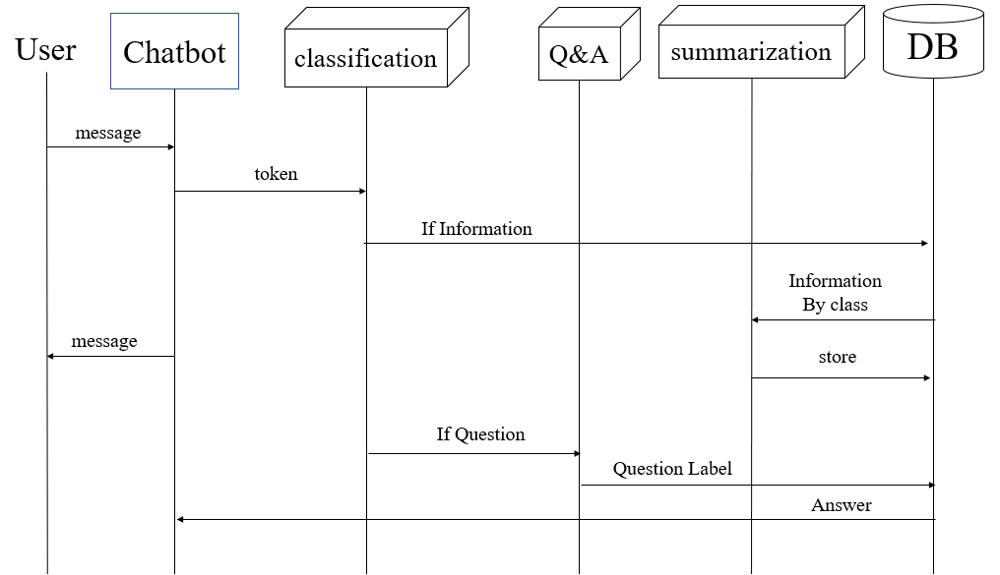

# Residential_Chatbot

Automatic Residential Chatbot Structure

Automatic Residential Chatbot Diagram

Todo
1. Chatting interface (web socket)
2. Chatbot API Server (NLP)
3. DB (NoSQL - MongoDB)
4. Model (ML - Transformer)

Execute Prototype Chatbot
1. run chatbot API server  
/main_app/bot_api/  
python manage.py runserver 0:8000   
2. run chating server  
/main_app/chating_interface  
node Server.js   

3. access 127.0.0.1/interface.html  
make and chat
   
